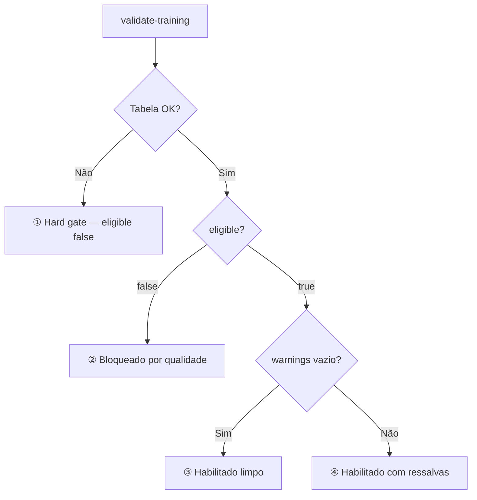

# Guia do front — validação e treino (modo strict)

Integração de `POST /prediction/validate-training` e `POST /prediction/train` com **`TRAINING_MODE=strict`** no servidor.

Detalhes de backend: [PREDICTION_PIPELINE.md](./PREDICTION_PIPELINE.md).

**Regra principal:** só habilitar o botão **Treinar** quando `eligible === true`.

---

## Endpoints

| Endpoint | Body | HTTP | Corpo |
|----------|------|------|--------|
| `POST /prediction/validate-training` | `{ "user_uuid": "..." }` | **200** sempre | `TrainingValidationResponse` |
| `POST /prediction/train` | `{ "user_uuid": "..." }` | **200** | `{ status: "trained", results: { clicks, impressions } }` |
| | | **422** | `{ detail: TrainingValidationResponse }` — **mesmo JSON** do validate |

O `/train` **revalida** no servidor; trate 422 mesmo após validate OK.

---

## Campos da resposta

### Raiz (`TrainingValidationResponse`)

| Campo | Tipo | UI |
|-------|------|-----|
| `eligible` | `boolean` | Habilita Treinar |
| `message` | `string` | Banner |
| `reasons` | `string[]` | Bloqueio — preenchido só se `eligible: false` |
| `warnings` | `string[]` | Diagnóstico / ressalvas — igual a `reasons` quando bloqueado; informativo quando `eligible: true` |
| `platforms` | `object` | Cards (`meta-ads`, `google-ads`, `tiktok-ads`) — `{}` no hard gate |
| `summary` | `object` | Métricas agregadas — zerado no hard gate |

### `platforms.{chave}`

| Campo | UI |
|-------|-----|
| `eligible` | Badge do conector |
| `reasons` | Lista **sem prefixo** (preferir isso aos bullets top-level) |
| `daily_rows`, `trainable_weeks` | Volume |
| `completeness` | Barras spend/clicks/impressions (mín. 95%) |
| `date_range` | Período com dado |

Labels: `meta-ads` → Meta Ads · `google-ads` → Google Ads · `tiktok-ads` → TikTok Ads

### `summary`

| Campo | UI |
|-------|-----|
| `train_rows_after_holdout` | Progresso vs **mínimo 30** |
| `trainable_weeks_total` | Semanas utilizáveis |
| `holdout_rows` | `8 × active_platforms` |
| `active_platforms` | Quantos conectores têm dado |
| `date_range` | Intervalo do histórico |

---

## Os 4 cenários (visão geral)



| # | `eligible` | `reasons` | `warnings` | `platforms` | Treinar |
|---|------------|-----------|------------|-------------|---------|
| ① Hard gate | `false` | 1 item | `[]` | `{}` | Não |
| ② Bloqueado | `false` | lista completa | = `reasons` | 3 chaves | Não |
| ③ Limpo | `true` | `[]` | `[]` | todos OK | Sim |
| ④ Ressalvas | `true` | `[]` | lista | mix OK/ruim | Sim |

**Importante:** `eligible` global **não** exige os 3 conectores OK — basta **≥ 1** elegível + pool global forte. Conectores ruins aparecem em `warnings` / `platforms.*` (cenário ④).

---

## `eligible: false` — tudo que o front precisa saber

Sempre: `message` = `"Cliente não habilitado para treinamento."` · Treinar **desabilitado**.

Existem **dois subtipos** com payloads diferentes.

### Subtipo A — Hard gate (tenant)

**Quando:** não dá para ler dados (`cross_ads_llm` inacessível ou **vazia**).

| Campo | Valor |
|-------|--------|
| `reasons` | **Exatamente 1 string** (tabela abaixo) |
| `warnings` | `[]` |
| `platforms` | `{}` — **não renderizar cards** |
| `summary` | Zeros — **não usar progresso** |

| Motivo (`reasons[0]`) | Significado para o usuário |
|------------------------|----------------------------|
| `Não foi possível acessar org_{uuid}_llm.cross_ads_llm.` | Problema de infra/schema; dados ainda não existem para este cliente |
| `Tabela cross_ads_llm vazia no schema org_{uuid}_llm.` | Schema existe, mas nenhum dado sincronizado ainda |

`{uuid}` = `user_uuid` sem hífens.

**UI:** banner + `reasons[0]` + CTA tipo “Conecte uma plataforma e aguarde a sincronização”.

---

### Subtipo B — Bloqueado por qualidade

**Quando:** há dados, mas o cliente **não passa** no strict.

| Campo | Valor |
|-------|--------|
| `reasons` | Lista com motivos **globais** + **por plataforma** |
| `warnings` | **Igual a `reasons`** (pode exibir a mesma lista em “O que melhorar”) |
| `platforms` | As 3 chaves com detalhe |
| `summary` | Preenchido — use para barras de progresso |

O global fica `false` se **qualquer** regra abaixo falhar (e não há ≥ 1 plataforma elegível quando aplicável).

#### Motivos globais (sem prefixo em `reasons`)

Aparecem como strings soltas no array top-level. Podem vir **vários** na mesma resposta.

| ID | Texto exato | O que significa | Dica de UI |
|----|-------------|-----------------|------------|
| **G1** | `Nenhuma plataforma suportada com dados (meta-ads, google-ads, tiktok-ads).` | Nenhum conector tem linha em `cross_ads_llm` | “Nenhuma plataforma com histórico” |
| **G2** | `Linhas de treino após holdout insuficientes: {N} (mínimo: 30, holdout: {H}).` | Pool semanal pequeno após reservar validação | Barra: `{N}/30` · `{H}` = `summary.holdout_rows` |
| **G3** | `Target 'clicks' sem variância no histórico treinável.` | Clicks constantes/zero — modelo não aprende | “Histórico de clicks sem variação” |
| **G4** | `Target 'impressions' sem variância no histórico treinável.` | Idem para impressions | “Histórico de impressões sem variação” |
| **G5** | `Nenhuma plataforma atende aos critérios mínimos de qualidade.` | **Todas** as plataformas falharam nos critérios P1–P4 | Resumo antes dos cards |

`{N}` = `summary.train_rows_after_holdout` · `{H}` = `summary.holdout_rows` (= `8 × active_platforms`).

#### Motivos por plataforma

**No card:** use `platforms.{chave}.reasons` (lista sem prefixo).

**No array top-level** (`reasons` / `warnings`), vêm **prefixados**:

```
{plataforma}: {motivo1}; {motivo2}
```

Exemplo: `meta-ads: Coluna 'spend' com 80% de preenchimento (mínimo: 95%).; Apenas 6 semanas treináveis (mínimo: 13).`

Só entram plataformas **com falha**. Plataformas OK não aparecem no top-level.

| ID | Texto em `platforms.*.reasons` | O que significa | Mínimo exigido |
|----|-------------------------------|-----------------|----------------|
| **P1** | `Sem registros na tabela cross_ads_llm.` | Conector sem dado (comum se não conectado) | Ter histórico |
| **P2** | `Coluna '{col}' com {pct}% de preenchimento (mínimo: 95%).` | Muitos NULLs em spend/clicks/impressions | 95% preenchido · `{col}` ∈ spend, clicks, impressions |
| **P3** | `Apenas {N} semanas treináveis (mínimo: 13).` | Pouco histórico semanal após warmup | 13 semanas |
| **P4** | `Apenas {N} linhas semanais após warmup (mínimo: 8).` | Poucas linhas após descartar warmup de features | 8 linhas |

`{N}` = `platforms.*.trainable_weeks` · `{pct}` = `completeness.{col}` em % (API envia 0.8 = 80%).

#### Exemplo completo (subtipo B)

```json
{
  "eligible": false,
  "message": "Cliente não habilitado para treinamento.",
  "reasons": [
    "Linhas de treino após holdout insuficientes: 12 (mínimo: 30, holdout: 16).",
    "Nenhuma plataforma atende aos critérios mínimos de qualidade.",
    "meta-ads: Coluna 'spend' com 80% de preenchimento (mínimo: 95%).; Apenas 6 semanas treináveis (mínimo: 13).",
    "google-ads: Sem registros na tabela cross_ads_llm.",
    "tiktok-ads: Sem registros na tabela cross_ads_llm."
  ],
  "warnings": ["…mesmo conteúdo de reasons…"],
  "platforms": {
    "meta-ads": {
      "eligible": false,
      "reasons": [
        "Coluna 'spend' com 80% de preenchimento (mínimo: 95%).",
        "Apenas 6 semanas treináveis (mínimo: 13)."
      ],
      "trainable_weeks": 6,
      "completeness": { "spend": 0.8, "clicks": 0.98, "impressions": 0.97 }
    },
    "google-ads": { "eligible": false, "reasons": ["Sem registros na tabela cross_ads_llm."], "daily_rows": 0 },
    "tiktok-ads": { "eligible": false, "reasons": ["Sem registros na tabela cross_ads_llm."], "daily_rows": 0 }
  },
  "summary": {
    "train_rows_after_holdout": 12,
    "holdout_rows": 16,
    "trainable_weeks_total": 22,
    "active_platforms": 1
  }
}
```

#### UI sugerida (subtipo B)

1. Banner erro → `message`
2. Bullets → `reasons[]`
3. Cards → `platforms.*` (badge + `reasons` locais)
4. Progresso → `summary.train_rows_after_holdout` vs 30

#### 422 no `/train` quando bloqueado

Mesmo objeto em `response.detail`. Parser **idêntico** ao validate.

**Caso raro** (validate passou, train falhou no pré-processamento):

```
Linhas de treino após holdout insuficientes: {N} (mínimo: 30).
```

(sem `holdout: {H}` no texto).

---

## `eligible: true` — resumo

### ③ Habilitado limpo

- `message`: `"Cliente habilitado para treinamento."`
- `reasons`: `[]` · `warnings`: `[]`
- Todos `platforms.*.eligible: true`
- Treinar habilitado; loading longo (1–3 min)

### ④ Habilitado com ressalvas

- `message`: `"Cliente habilitado para treinamento com ressalvas."`
- `reasons`: `[]` · `warnings`: lista (ex. conectores sem dados)
- Mix em `platforms.*` — global OK, alguns conectores ruins
- Treinar **habilitado**; opcional: modal confirmando que o modelo usa só dados disponíveis

```json
{
  "eligible": true,
  "message": "Cliente habilitado para treinamento com ressalvas.",
  "reasons": [],
  "warnings": [
    "google-ads: Sem registros na tabela cross_ads_llm.",
    "tiktok-ads: Sem registros na tabela cross_ads_llm."
  ],
  "platforms": {
    "meta-ads": { "eligible": true, "reasons": [] },
    "google-ads": { "eligible": false, "reasons": ["Sem registros na tabela cross_ads_llm."] },
    "tiktok-ads": { "eligible": false, "reasons": ["Sem registros na tabela cross_ads_llm."] }
  },
  "summary": { "train_rows_after_holdout": 40, "active_platforms": 1 }
}
```

---

## `/train` — sucesso (HTTP 200)

```json
{
  "status": "trained",
  "duration_seconds": 86.4,
  "results": {
    "clicks": {
      "trained_date_start": "2023-05-23",
      "trained_date_end": "2026-06-19",
      "relative_margin_70": 1.27,
      "r2": 0.71,
      "best_model_id": "GradientBoostingRegressor"
    },
    "impressions": { "…" : "…" }
  }
}
```

Exibir: sucesso, duração, margem e período por target.

---

## Fluxo no front (pseudocódigo)

```
aoAbrirTela(userUuid):
  res = POST /prediction/validate-training
  renderizar(res)

renderizar(res):
  se não res.eligible:
    bannerErro(res.message)
    lista(res.reasons)
    se res.platforms não vazio:
      para cada plataforma em res.platforms: card(plataforma)
      métricas(res.summary)
  senão:
    se res.warnings não vazio: bannerAviso(res.message) + lista(res.warnings)
    senão: bannerOk(res.message)
    cards + métricas opcionais
  botãoTreinar.habilitado = res.eligible

aoTreinar(userUuid):
  res = POST /prediction/train
  se 200: sucesso(res)
  se 422: renderizar(res.detail)
```

---

## FAQ rápido

| Pergunta | Resposta |
|----------|----------|
| 1 de 3 conectores ruim bloqueia? | **Não necessariamente** — pode ser cenário ④ com `eligible: true` |
| `warnings` bloqueia? | **Não** — só `eligible: false` |
| Parsear `"meta-ads: ..."` no top-level? | Evite — use `platforms.meta-ads.reasons` |
| Ignorar 422 no train? | **Não** — dados podem mudar entre chamadas |

---

## Checklist

- [ ] `eligible` → botão Treinar
- [ ] Hard gate: só `reasons[0]`, sem cards
- [ ] Bloqueado: `reasons` + cards + `summary`
- [ ] Ressalvas: `warnings` com `eligible: true`
- [ ] `/train`: loading + 422 com `detail`
- [ ] Labels Meta / Google / TikTok nos cards

---

## Referências

- [PREDICTION_PIPELINE.md](./PREDICTION_PIPELINE.md)
- `models/training_validation.py` · `utils/training_validation.py`
